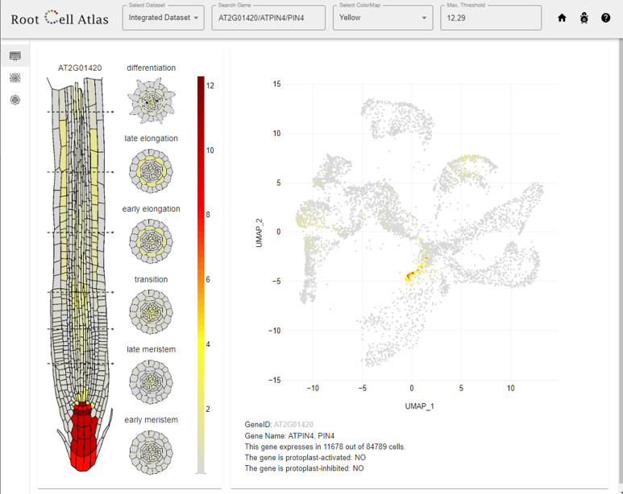

class: left, middle
####Computer Practice 4

##Single cell Transcriptomics using R
##Seurat: subsetting and integrating the data
####Victoria Mironova 
####Associate Professor, Department of Plant Systems Physiology
####RIBES, Radboud University


---
class: middle, inverse
```{r include = FALSE}
knitr::opts_chunk$set(message = FALSE, warning = FALSE, fig.retina = 3)
set.seed(100)
```

#Course structure

- C1. From reads to counts
- C2. From counts to clusters
- C3. From clusters to marker genes
- *C4. Subsetting and integrating the data*
- C5. Developmental trajectories, developmental states.

The course materials can be found via [GitHub](https://github.com/VictoriaVMironova/ScTranscriptomics_in_plants)
---
# Step 1. Data loading into R

Lets reuse the Seurat Object we created in the tutorial 2.

```{r libraries,  echo = FALSE}
library(Seurat)
library(tidyverse)
```

```{r ATML1 seurat object}
leaf.dataset<-readRDS('Data/leaf.dataset.rds')
show(leaf.dataset)
```

---
class: inverse, middle

#The learning goals:

- To understand the internal structure of Seurat object

- To learn how to adjust the number of clusters

- To subset single-cell data

- To integrate single-cell datasets

---
# Aim 1. Understanding Seurat object

```{r table Seurat, echo = FALSE}
df <- data.frame(slot = c('assays', 'meta.data', 'active.assay', 'active.ident', 'graphs', 'reductions', 'project.name', 'tools', 'misc', 'version'),
                 description = c("A list of assays within this object", "Cell-level meta data", "Name of active, or default, assay", "Identity classes for the current object", "A list of nearest neighbor graphs", "A list of DimReduc objects", "User-defined project name (optional)", "Empty list. Tool developers can store any internal data from their methods here", "Empty slot. User can store additional information here", "Seurat version used when creating the object"))
knitr::kable(df, caption = "Seurat object structure.")
```
---
#Step 2. Looking at the Seurat object structure
```{r seurat object 1}
str(leaf.dataset)
```
---
# Step 2. Exploring Seurat object

```{r seurat object 2}
show(leaf.dataset)
show(leaf.dataset@assays)
```
---
# Step 2. Exploring Seurat object

```{r seurat object 3}
show(leaf.dataset@assays$RNA@counts)
```
---
# Step 2. Exploring Seurat object

```{r seurat object 4}
head(leaf.dataset@assays$RNA@counts@Dimnames[1])
```
---
# Step 2. Exploring Seurat object

```{r seurat object 5}
head(leaf.dataset@meta.data)
```

```{r seurat object 6}
head(leaf.dataset@meta.data$percent.mt)
```
---
#Step 2.1. Getting data out of Seurat Object
.pull-left[
```{r seurat object 7}
head(leaf.dataset@meta.data$percent.mt)
```
]
.pull-right[
```{r seurat object 8}
hist(leaf.dataset@meta.data$percent.mt)
```
]
---
#Step 2.2. Adding data into Seurat Object
```{r add seurat object}
MetaData <- as.data.frame(leaf.dataset@meta.data)
Status <- MetaData %>% 
        mutate(Status = case_when(
          nFeature_RNA <= 1500 ~ "old",
          (nFeature_RNA > 1500 & nFeature_RNA < 3000)  ~ "adult",
          nFeature_RNA >= 3000 ~ "young")) %>%
        select(Status)
head(Status)
```

---
#Step 2.2. Adding data into Seurat Object
```{r add seurat object 3}
leaf.dataset <- AddMetaData(
  object = leaf.dataset,
  metadata = data.frame(Status),
  col.name = "Status")
```
--
```{r add seurat object 4}
head(leaf.dataset@meta.data)
```
---
#Step 2.3. Methods you can apply to Seurat object

```{r add seurat object 5}
utils::methods(class = 'Seurat')
```
---
#Step 2.3. Methods to apply to Seurat Object
```
```{r, Idents info}
summary(Idents(leaf.dataset))
```
---
class: inverse, middle

#Aim 2

- Adjust the number of clusters

---
#The issue we faced
It often happens that we cannot annotate all the clusters

.pull-left[
```{r DimPLot1, fig.height = 6, echo = FALSE}
DimPlot(leaf.dataset, label = TRUE, pt.size = 1.5, label.size = 10) + NoLegend()
```
]
.pull-right[
```{r Ara leaf2, echo=FALSE, fig.cap="Graphical summary from (Lopez et al., 2021)", out.width = '80%'}
knitr::include_graphics("Figures/ScLeaf.jpg")
```
]
---
#Adjusting the clusters number: resolution 1
.pull-left[
```{r clusters adjust res 1, eval = FALSE}
leaf.dataset <- FindClusters(leaf.dataset, 
                                  resolution = 1, 
                                  verbose = FALSE)
DimPlot(leaf.dataset, 
        label = TRUE, 
        pt.size = 1.5, 
        label.size = 10) + 
        NoLegend() 
```
]
.pull-right[
```{r clusters adjust res 1 out, echo = FALSE, eval = TRUE, ref.label='clusters adjust res 1'}
```
]
---
#Making less clusters: resolution 0.2
.pull-left[
```{r clusters adjust res 0.2, eval = FALSE}
leaf.dataset <- FindClusters(leaf.dataset, 
                                  resolution = 0.2, 
                                  verbose = FALSE)
DimPlot(leaf.dataset, 
        label = TRUE, 
        pt.size = 1.5, 
        label.size = 10) + 
        NoLegend() 
```
]
.pull-right[
```{r clusters adjust res 0.2 out, echo = FALSE, eval = TRUE, ref.label='clusters adjust res 0.2'}
```
]
---
#Making more clusters: resolution 1.5
.pull-left[
```{r clusters adjust res 1.5, eval = FALSE}
leaf.dataset <- FindClusters(leaf.dataset, 
                                  resolution = 1.5, 
                                  verbose = FALSE)
DimPlot(leaf.dataset, 
        label = TRUE, 
        pt.size = 1.5, 
        label.size = 10) + 
        NoLegend() 
```
]
.pull-right[
```{r clusters adjust res 1.5 out, echo = FALSE, eval = TRUE, ref.label='clusters adjust res 1.5'}
```
]
---
# Exploring Seurat object at different resolution
The clusters taken with different resolution can be found in the metadata

```{r explore resolution}
head(leaf.dataset@meta.data)
```

---
#Exploring Seurat object at different resolution

You can change the active identitities (clusters) in the Seurat object any time:

```{r SetIdent}
summary(leaf.dataset@active.ident)
leaf.dataset <- SetIdent(leaf.dataset, value = leaf.dataset@meta.data$SCT_snn_res.0.2)
summary(leaf.dataset@active.ident)
```

---
class: inverse, middle

#Aim 3

- Subset the single-cell data

---
#Subset the single-cell data

You can take a portion of the cells using subset function: </br>

?SeuratObject::subset

---
#Subset the single-cell data: clusters

```{r subset idents, fig.height = 6}
leaf.dataset <- SetIdent(leaf.dataset, value = leaf.dataset@meta.data$SCT_snn_res.1)
mesophyll <- subset(leaf.dataset, idents = c("1", "2"))
DimPlot(mesophyll, label = TRUE, pt.size = 1.5, label.size = 10) + NoLegend()
```

---
#Subset the single-cell data: rest clusters 

```{r asubset inverse, fig.height = 6}
rest <- subset(leaf.dataset, idents = c(1, 2), invert = TRUE)
DimPlot(rest, label = TRUE, pt.size = 1.5, label.size = 10) + NoLegend()
```
---
#Subset: based on a gene expression

Creating a Seurat object based on gene expression

```{r subset gene expression, fig.height = 6, fig.width = 12}
ATML1_pos <- subset(leaf.dataset, subset = AT4G21750 > 0.1)
DimPlot(ATML1_pos, label = TRUE, pt.size = 1.5, label.size = 10) + NoLegend()
```
---
#Subset: based on genes expression
```{r subset genes, fig.height = 6}
ATML1_PDF2 <- subset(leaf.dataset, subset = (AT4G21750 > 0.1 & AT4G04890 >0.1))
DimPlot(ATML1_PDF2, label = TRUE, pt.size = 1.5, label.size = 10) + NoLegend()
```
---
class: inverse, middle

#Your turn

- Run the script with your dataset (GSM5097889)

- Explore its structure, look at the meta data

- Explore the dataset under different resolution

- Train subseting the data 

---
class: inverse, middle

#Aim 4

- Integrate the single-cell data

---
#The data: scRNA-Seq from leaves

In the computer practice, we are using the single-cell dataset from Arabidopsis leaf:
.pull-left[
*Lopez-Anido CB, Vatén A, Smoot NK, Sharma N et al. Single-cell resolution of lineage trajectories in the Arabidopsis stomatal lineage and developing leaf. Dev Cell 2021 Apr 5;56(7):1043-1055.e4.*
]
.pull-right[
```{r Ara leaf, echo=FALSE, fig.cap="Graphical summary from (Lopez et al., 2021)", out.width = '80%'}
knitr::include_graphics("Figures/ScLeaf.jpg")
```
]
---
#The data details

The data is stored on GEO database: https://www.ncbi.nlm.nih.gov/geo/query/acc.cgi?acc=GSE167135 </br>
In fact, they provided four 10xGenomics samples:
- GSM509788 (ATML1p 10X Genomics replica 3).
- GSM509789 (TMMp 10X Genomics replica 1),
- GSM509790 (TMMp 10X Genomics replica 2),
- GSM509791 (TMMp 10X Genomics replica 3).

---
#Integrating  the replicas: step 1

When we assume that the data is comparable (e.g. replicas) we can merge the Seurat datasets before Normalization. 

- Step 1: Loading the data
```{r loading replicas}
GSM5097889.counts <- Read10X("Data/GSM5097889", gene.column = 1)
GSM5097890.counts <- Read10X("Data/GSM5097890", gene.column = 1)
GSM5097891.counts <- Read10X("Data/GSM5097891", gene.column = 1)
```

---
#Integrating  the replicas: step 2

- Step 2: Creating Seurat object

```{r Seurat object replicas}
GSM5097889<- CreateSeuratObject(counts = GSM5097889.counts, project = "r1")
GSM5097890 <- CreateSeuratObject(counts = GSM5097890.counts, project = "r2")
GSM5097891 <- CreateSeuratObject(counts = GSM5097891.counts, project = "r3")
```

---
#Integrating  the replicas: step 3

- Step 3: Merging Seurat objects

```{r merging replicas}
dim(GSM5097889)
dim(GSM5097890)
dim(GSM5097891)
leaf.dataset.merged<- merge(GSM5097889,c(GSM5097890,GSM5097891))
dim(leaf.dataset.merged)
```
---
#Integrating  the replicas: step 4

- Step 4a: Standard processing procedures: quality control

```{r qq replicas, fig.height = 6}
leaf.dataset.merged[["percent.mt"]] <- PercentageFeatureSet(leaf.dataset.merged, pattern = "^ATM")
leaf.dataset.merged[["percent.ct"]] <- PercentageFeatureSet(leaf.dataset.merged, pattern = "^ATC")
VlnPlot(object = leaf.dataset.merged, features = c("nFeature_RNA", "nCount_RNA","percent.ct","percent.mt"), ncol = 5)
leaf.dataset <- subset(leaf.dataset.merged, subset = percent.mt <= 20 & percent.ct <= 20 & nCount_RNA >=500)
dim(leaf.dataset.merged)
```
---
#Integrating  the replicas: step 4

- Step 4a: Standard processing procedures: quality control

```{r qq2 replicas}
leaf.dataset.merged <- subset(leaf.dataset.merged, subset = percent.mt <= 20 & percent.ct <= 20 & nCount_RNA >=500)
dim(leaf.dataset.merged)
```
---
#Integrating  the replicas: step 4

- Step 4b: Standard processing procedures: normalization, clustering, saving

```{r SCT replicas}
leaf.dataset.merged <- SCTransform(leaf.dataset.merged)
leaf.dataset.merged <- RunPCA(leaf.dataset.merged,verbose = FALSE)
leaf.dataset.merged <- RunUMAP(leaf.dataset.merged, dims = 1:50, verbose = FALSE)
leaf.dataset.merged <- FindNeighbors(leaf.dataset.merged, dims = 1:50, verbose = FALSE)
leaf.dataset.merged <- FindClusters(leaf.dataset.merged, resolution = 1,verbose = FALSE)
saveRDS(leaf.dataset.merged, 'Data/leaf.dataset.merged.rds')
```
---
#Integrating  the replicas: step 5

- Step 5: Standard processing procedures: vizualization

```{r vizualizing replicas, fig.height = 6.5}
DimPlot(leaf.dataset.merged, group.by = "orig.ident")
DimPlot(leaf.dataset.merged, label = TRUE)
```
---
#Integrating  distinct datasets

One can also integrate distinct datasets like:
- control & treatment 
- different datasets generated by different teams (different methods)
- from different tissues
- from different species
- scRNA-Seq and bulk RNA-Seq

For that other functions should be used like `FindVariableFeatures`, `FindIntegrationAnchors`, `IntegrateData`.
You can read more about that [here](https://satijalab.org/seurat/archive/v3.0/immune_alignment.html)

---
#RootCellAtlas: an integrated dataset



- https://rootcellatlas.org/