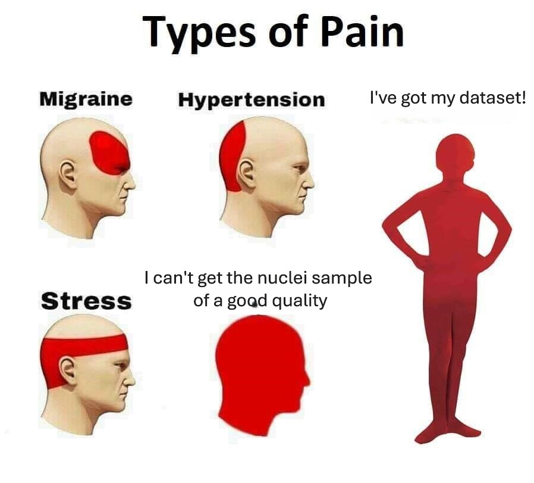
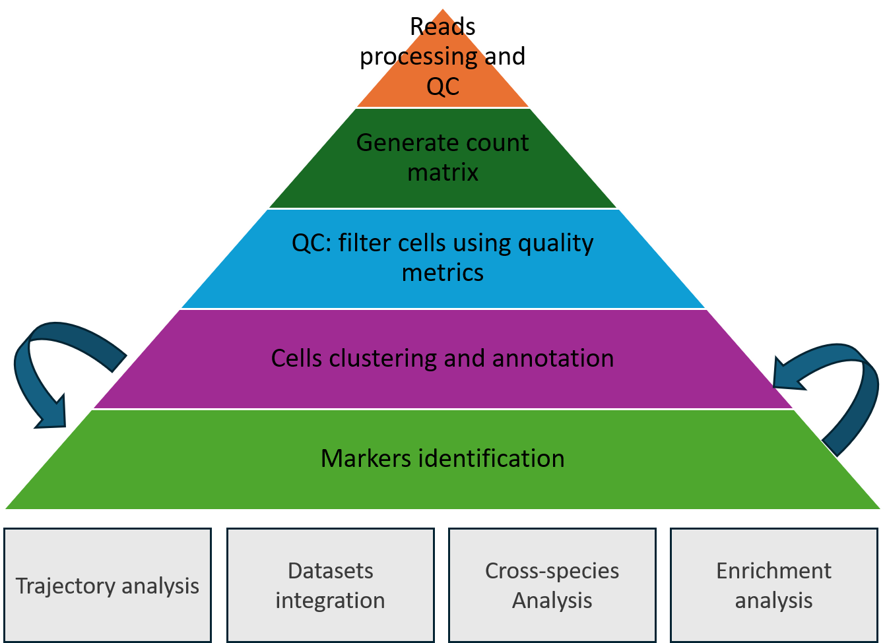
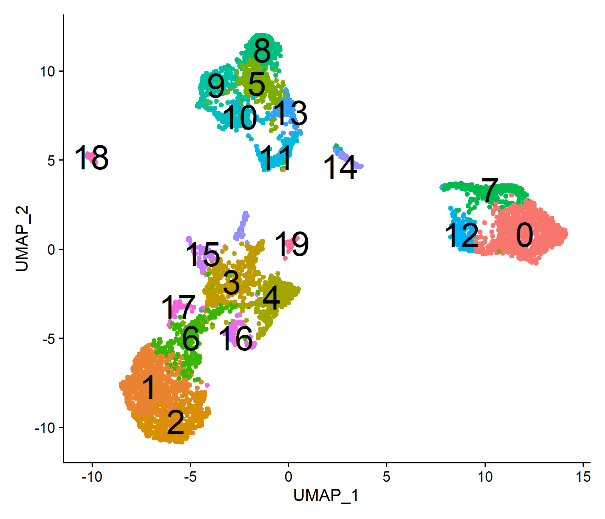
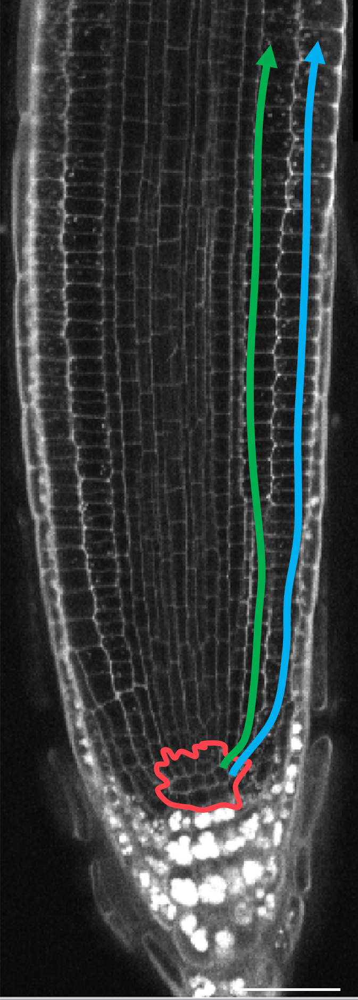
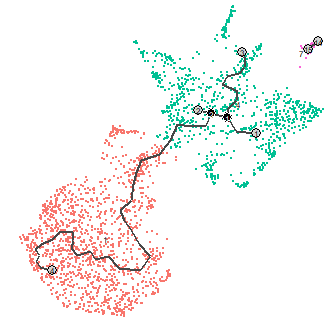
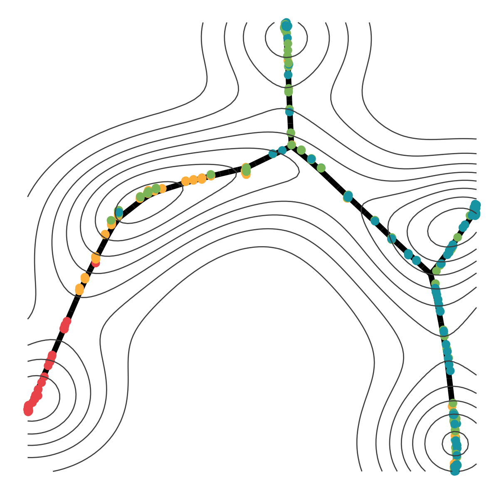
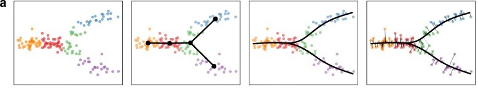
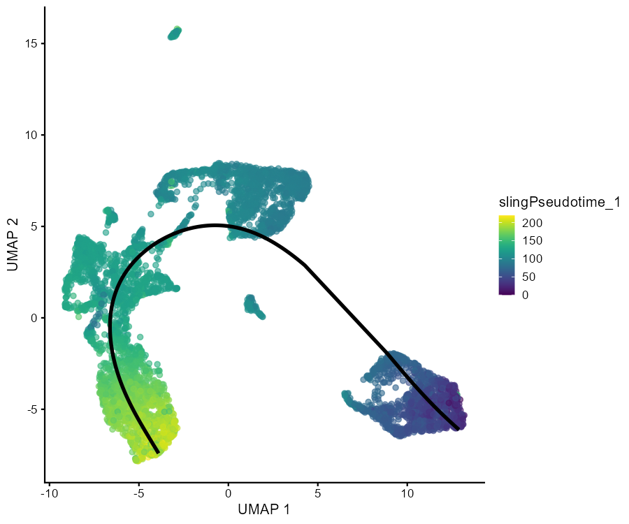
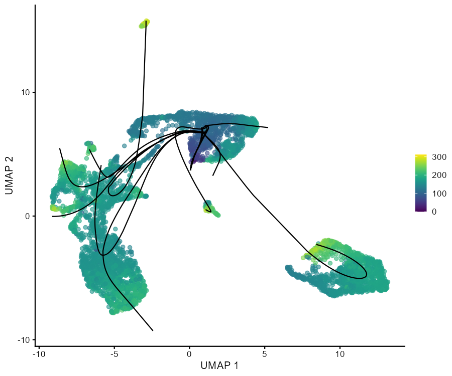
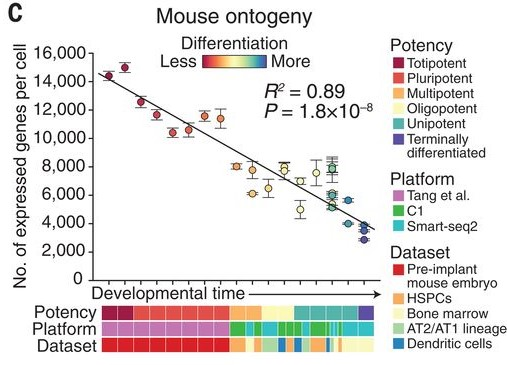

class: left, middle
####Lecture

##Decoding Cell Secrets: 
##Cutting-Edge Computational Tools for scRNA-Seq
####Victoria Mironova 
####Associate Professor, Department of Plant and Animal Biology, Radboud University


---
class: middle

```{r include = FALSE}
knitr::opts_chunk$set(message = FALSE, warning = FALSE, fig.retina = 3)
set.seed(100)
library(Seurat)
library(tidyverse)
```

```{r pain, echo=FALSE, out.width = '50%'}

```

---
class: inverse, middle

#The learning goals for this lecture:

- Overview of the standard workflow (with Seurat)

- Pseudotime analysis

- Datasets integration and meta-analysis


---
#Data in the lecture

In the lecture and computer practice, we use the single-cell dataset from Arabidopsis leaf:
.pull-left[
*Lopez-Anido CB, Vatén A, Smoot NK, Sharma N et al. Single-cell resolution of lineage trajectories in the Arabidopsis stomatal lineage and developing leaf. Dev Cell 2021 Apr 5;56(7):1043-1055.e4.*


```{r load RDS1}
leaf.dataset <- readRDS('Data/leaf.dataset.rds')
```

]
.pull-right[
```{r Ara leaf, echo=FALSE, fig.cap="Graphical summary from (Lopez et al., 2021)", out.width = '80%'}
knitr::include_graphics("Figures/ScLeaf.jpg")
```
]

---
#Standard workflow: overview

```{r workflow, echo=FALSE, out.width = '60%'}

```

---
class: middle, inverse

#The standard pipeline: hands-on

You will test the standard pipeline in the computer practice: 
- C1. From reads to counts
- C2. From counts to clusters
- C3. From clusters to marker genes
- C4. Subsetting and integrating the data.

The course materials can be found via [GitHub](https://github.com/VictoriaVMironova/ScTranscriptomics_in_plants)
---
#Standard pipeline: cell clusters

.pull-left[

##UMAP
Uniform Manifold Approximation and Projection for Dimension Reduction.
The goal of UMAP is to place similar cells together and different cells further apart on a plot.

```{r DimPlot2, fig.height = 6, echo = FALSE, out.width = '80%'}
DimPlot(leaf.dataset, label = TRUE, pt.size = 1.5, label.size = 10) + NoLegend()
```
]
.pull-right[
##Cell Clusters
✅  What are clusters? Groups of cells with similar gene expression profiles.


✅  How are they identified? Clustering methods (Louvain, Leiden) based on shared transcriptomic features.


✅  Do they always represent known cell types? Not really...


"Clusters: Are they real cell types or just computational wishful thinking?" 😆
]

---
#Reading UMAPs

UMAP is a non-deterministic, manifold learning algorithm that can change cluster positioning across runs due to variations in implementation, parameter settings, or updates in Seurat.

.pull-left[

##version 2024
- 19 clusters
```{r version2024, fig.height = 6, echo = FALSE, out.width = '70%'}

```

]

.pull-right[
##version 2025
- 17 clusters
```{r DimPlot3, fig.height = 6, echo = FALSE, out.width = '70%'}
DimPlot(leaf.dataset, label = TRUE, pt.size = 1.5, label.size = 10) + NoLegend()
```

]

---
#Summary on dealing with UMAPs

✅ UMAP is stochastic → Always set a seed for reproducibility.

```{r, set seed, eval = FALSE}
set.seed(100)
```

✅ Software updates can change defaults → Always check and document parameter settings.

✅ Save and reuse UMAP coordinates if needed:
```{r, umap1, eval = FALSE}
leaf.dataset[["umap"]] <- leaf.dataset@reductions$umap

```

✅ UMAP depends on preprocessing → Feature selection, PCA, and clustering affect embeddings.

```{r, umap, eval = FALSE}
leaf.dataset <- RunUMAP(leaf.dataset, dims = 1:30, n.neighbors = 20, min.dist = 0.3)
leaf.dataset <- RunUMAP(leaf.dataset)

```

✅ Compare UMAPs critically → A shift in cluster position may not mean a change in biology!

---
class: middle, inverse

#Developmental trajectories and pseudotime

- the pseudotime concept
- pseudotime inference methods
- pros and cons

The course materials can be found via [GitHub](https://github.com/VictoriaVMironova/ScTranscriptomics_in_plants)

---
#Developmental trajectories

.pull-left[

##Developmental progression
```{r root, echo=FALSE, out.width = '30%'}

```

]

.pull-right[
##Pseudotime

A computational approach to order single cells along a developmental progression.
```{r pseudotime, echo=FALSE, out.width = '70%'}

```


]
---
# Challenges in applying pseudotime to plants
.pull-left[

##Developmental progression
```{r root, echo=FALSE, out.width = '30%'}

```

]

.pull-right[
✅   Non-linear differentiation trajectories in plant tissues

✅    Lack of validated marker genes for all transition states
 
✅   Protoplasting effects on trajectory inference
]

---
#Pseudotime inference methods (selected)

In R:
-	Monocle3: Principal graph learning for trajectory inference
-	Slingshot: Cluster-based trajectory modeling
- CytoTrace: measuring cell differentiation level

In Python:
-	Diffusion Pseudotime (DPT): Distance-based ordering (Scanpy)
-	RNA Velocity: Predicting future cell states using spliced/unspliced RNA (scVelo)

---
#Monocle - Graph-Based Pseudotime

.pull-left[
✅ How it works:

Uses graph-based trajectory inference to learn a principal tree structure.
Infers multiple branching points and orders cells automatically.
No clustering required, but clustering improves accuracy.

✅ Best for:

Complex branched trajectories.
Systems with multiple fate decisions (e.g., cell-type specialization).

❌ Weaknesses:

Topology-sensitive (overfitting if too many branches).
Can be affected by batch effects.

📌 Use Case: regeneration with multiple differentiation fates and transiting stages.
]

.pull-right[

]

---
#Monocle - use case


---
#Slingshot - Smooth Curve Fitting on Clusters

.pull-left[
✅ How it works:

Requires pre-defined clusters.
Constructs a minimum spanning tree (MST) and fits principal curves through clusters.
Assigns pseudotime along these curves.

✅ Best for:

Smooth, gradual differentiation processes.
Systems where clusters are well-defined.

❌ Weaknesses:

Requires clustering first.
Not ideal for highly branched trajectories.

📌 Use Case: root development where cells differentiate along a smooth gradient.
]
.pull-right[

To identify a trajectory, one might imagine simply “fitting” a one-dimensional curve so that it passes through the cloud of cells in the high-dimensional expression space.



]
---
#Slingshot: use case

```{r, eval=FALSE}
sce <- as.SingleCellExperiment(leaf.dataset)
sce.sling <- slingshot(sce, reducedDim='PCA')
embedded <- embedCurves(sce.sling, "UMAP")
embedded <- slingCurves(embedded)[[1]]
embedded <- data.frame(embedded$s[embedded$ord,])
plotReducedDim(sce.sling, dimred = "UMAP", colour_by = "slingPseudotime_1") +
  geom_path(data = embedded, aes(x = umap_1, y = umap_2), size = 1.2, color = "black")
```

```{r slingshot 2, out.width= "40%", echo = FALSE}

```
---
#Slingshot: different starting points

.pull-left[
```{r slingshot basic code, out.width= "40%", eval = FALSE}
sce.sling2 <- slingshot(sce, cluster=sce$seurat_clusters, reducedDim='PCA')
```
```{r slingshot basic, out.width= "80%", echo = FALSE}

```
]
.pull-right[
```{r slingshot 9 code, out.width= "40%", eval = FALSE}
sce.sling2 <- slingshot(sce, start.clus= "9", cluster=sce$seurat_clusters, reducedDim='PCA')
```

```{r slingshot 9, out.width= "80%", echo = FALSE}

```
]
---
#CytoTrace: differentiation state

.pull-left[
✅ How it works:

Cells with higher total gene counts are assumed to be less differentiated.
Cells with fewer expressed genes are placed later in pseudotime.

✅ Best for:

Developmental processes where differentiation is driven by gene count complexity.
Simple linear trajectories with no major branching.

❌ Weaknesses:

Cannot model complex branching.
May be affected by batch effects or sequencing depth differences.

📌 Use Case: Root tip differentiation where gene expression complexity declines from stem cells to specialized cells.
]

.pull-right[


]

---
#CytoTrace: use case


---
#Summary on pseudotime inference methods

There are no one pseudotime inference method that always order single cells properly according to the differentiation progression. But one can improve the output choosing the method wisely:

```{r summary_table_kable, echo=FALSE}
library(knitr)

# Create the table as a data frame
summary_table <- data.frame(
  Scenario = c(
    "Simple, linear differentiation",
    "Complex, multi-branch differentiation",
    "Continuous, smooth differentiation",
    "No predefined clusters available",
    "Predefined clusters available",
    "Global differentiation potential (early vs. late)"
  ),
  Best_Method = c(
    "CytoTRACE",
    "Monocle3",
    "Slingshot",
    "CytoTRACE or Monocle3",
    "Slingshot",
    "CytoTRACE"
  )
)

# Print the table
kable(summary_table, caption = "Summary of Pseudotime Methods")
```

